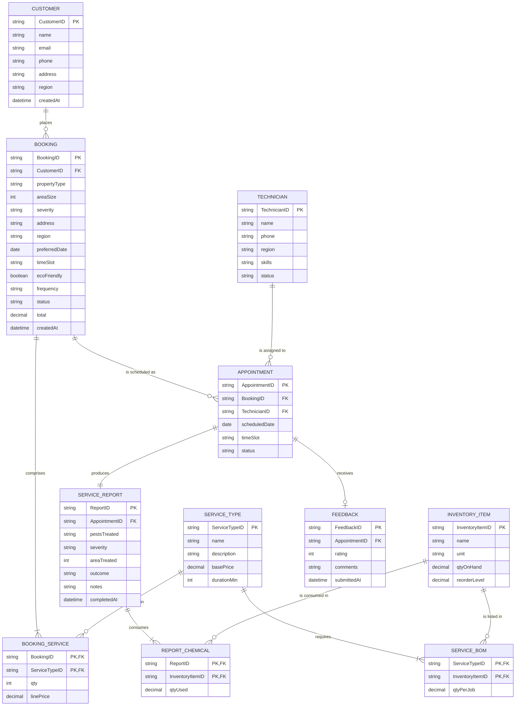

# BugBuster Pro — Service Management Module
## SCOPE & DATA-MODEL DESIGN (Phases 0–1)
*Grounded in Kendall & Kendall, Systems Analysis and Design, 10th ed. — frameworks referred to by name only.*

---

## 1. Scope Statement
The **Service Management Module** is a mobile-friendly static web app that lets **customers** of BugBuster Pro (a pest-control company) register, book pest-control services, track activity, and leave feedback; lets **technicians** file on-site service reports; and gives the back-office **dispatcher/coordinator** and **manager** the tools to confirm bookings, assign technicians, manage chemical/equipment inventory, and review KPIs/analytics. The app is pure HTML/CSS/vanilla-JS, deploys to Vercel with zero config, stores state in `localStorage`, and mirrors a defined set of keys to **Firebase Realtime Database** so a customer action on a phone appears on the admin laptop in real time. If Firebase is not configured, the app runs fully on `localStorage` (graceful fallback).

**Actors:** Customer · Technician · Dispatcher/Coordinator · Manager.

**In scope:** service catalog, booking flow (multi-service, options), simulated payment/confirmation, live activity tracking, feedback, technician assignment + scheduling, service reports with inventory decrement, inventory ledger, analytics, input validation, demo auth, audit trail.
**Out of scope:** real payment gateway, route optimisation, procurement, payroll/HR, native mobile apps, production-grade auth (demo-grade only, clearly labelled).

## 2. Assumptions (each a deliberate choice — adjust to your brief)
1. **[ASSUMPTION]** Single operating region (Yogyakarta area), single currency (IDR), `DD-MM-YYYY` dates, day split into four time slots.
2. **[ASSUMPTION]** Auth is **demo-grade** — a `localStorage` flag gates `/admin`; this is acceptable for a course prototype and is labelled as such in the UI and README.
3. **[ASSUMPTION]** A booking may contain **one or more** service types (cart-style); the common case is one.
4. **[ASSUMPTION]** A confirmed booking is realised as **one** appointment in the common case (the schema allows more for re-visits); each appointment has **one** technician.
5. **[ASSUMPTION]** Each **completed** appointment yields **exactly one** service report; a customer may leave **at most one** feedback per completed service.
6. **[ASSUMPTION]** Booking status set is fixed: `Requested → Confirmed → Technician Assigned → In Progress → Completed`, plus `Cancelled`. Feedback rating is an integer 1–5.
7. **[ASSUMPTION]** i18n (EN/ID) is **partially** delivered: customer-facing service names are bilingual (e.g. "Anti-Termite / Anti-Rayap"); a full toggle engine is omitted to keep scope tight — noted as a scoping decision, not an oversight.
8. **[ASSUMPTION]** Personal data (name/phone/address) is treated as protected; sanitisation on input and least-privilege on `/admin` apply.

## 3. Architecture (the proven static + RTDB + Vercel pattern)
- **Pure static, multi-page**, no framework/bundler/build step. One `.html` per view.
- **`js/storage.js`** is the *stable method surface* — all state and business logic live behind named methods (`Storage.createBooking()`, `Storage.assignTechnician()`, `Storage.fileReport()` …), so the backend could later be swapped (e.g. Supabase/Postgres + REST) without touching the UI.
- **`js/data.js`** = immutable seed catalog (services, options, BOM) + demo seed.
- **`js/firebase-sync.js`** mirrors `SYNC_KEYS` (all `bb_` keys) to `store/<key>` and listens for changes; **array-coercion fix** in `Storage._get` normalises RTDB's object-serialised sparse arrays back to real arrays so `.map()/.filter()` never crash.
- **Key prefix** `bb_`; **ID scheme** human-readable + classifying (K&K Ch. 15 coding): `BK-2026-0001` (booking, carries a **Luhn check digit**), `TC-01` (technician), `SR-2026-0001` (service report), `AP-2026-0001` (appointment), `FB-2026-0001` (feedback), `CU-2026-0001` (customer).

---

## 4. DATABASE DESIGN — ERD (K&K Ch. 13)

### 4.1 Entities, primary keys, foreign keys
| Entity | PK | FKs | Key attributes |
|---|---|---|---|
| `CUSTOMER` | CustomerID | — | name, email, phone, address, region, createdAt |
| `SERVICE_TYPE` | ServiceTypeID | — | name, description, basePrice, durationMin |
| `BOOKING` | BookingID | CustomerID | createdAt, propertyType, areaSize, severity, address, region, preferredDate, timeSlot, ecoFriendly, frequency, status, total |
| `BOOKING_SERVICE` *(assoc.)* | (BookingID, ServiceTypeID) | BookingID, ServiceTypeID | qty, linePrice |
| `TECHNICIAN` | TechnicianID | — | name, phone, region, skills, status |
| `APPOINTMENT` | AppointmentID | BookingID, TechnicianID | scheduledDate, timeSlot, status |
| `SERVICE_REPORT` | ReportID | AppointmentID | pestsTreated, severity, areaTreated, outcome, notes, completedAt |
| `REPORT_CHEMICAL` *(assoc.)* | (ReportID, InventoryItemID) | ReportID, InventoryItemID | qtyUsed |
| `FEEDBACK` | FeedbackID | AppointmentID | rating, comments, submittedAt |
| `INVENTORY_ITEM` | InventoryItemID | — | name, unit, qtyOnHand, reorderLevel |
| `SERVICE_BOM` *(assoc.)* | (ServiceTypeID, InventoryItemID) | ServiceTypeID, InventoryItemID | qtyPerJob |

### 4.2 Relationships & cardinality (M:N always resolved via an associative entity)
- CUSTOMER **places** BOOKING — 1:M
- BOOKING **comprises** SERVICE_TYPE — **M:N → `BOOKING_SERVICE`**
- BOOKING **is scheduled as** APPOINTMENT — 1:M (commonly 1:1)
- TECHNICIAN **is assigned to** APPOINTMENT — 1:M
- APPOINTMENT **produces** SERVICE_REPORT — 1:1
- SERVICE_REPORT **consumes** INVENTORY_ITEM — **M:N → `REPORT_CHEMICAL`**
- APPOINTMENT **receives** FEEDBACK — 1:0..1
- SERVICE_TYPE **requires** INVENTORY_ITEM — **M:N → `SERVICE_BOM`**

### 4.3 ERD (Mermaid `erDiagram`, Crow's-foot)


### 4.4 Normalization to 3NF (three steps, on the booking-with-services case)
**UNF** — a booking slip with a repeating group of services and embedded customer/service text:
```
BOOKING_SLIP(BookingID, CreatedAt, CustomerID, CustomerName, CustomerPhone,
             { ServiceTypeID, ServiceName, BasePrice, Qty })   ← repeating group
```
**1NF** — remove the repeating group; PK becomes the composite (BookingID, ServiceTypeID):
```
(BookingID, ServiceTypeID, CreatedAt, CustomerID, CustomerName, CustomerPhone,
 ServiceName, BasePrice, Qty)
```
**2NF** — remove partial dependencies (attributes depending on only part of the key):
`CreatedAt, CustomerID, CustomerName, CustomerPhone` depend on BookingID only; `ServiceName, BasePrice` on ServiceTypeID only; `Qty` on the whole key →
```
BOOKING(BookingID, CreatedAt, CustomerID, CustomerName, CustomerPhone)
SERVICE_TYPE(ServiceTypeID, ServiceName, BasePrice)
BOOKING_SERVICE(BookingID, ServiceTypeID, Qty)
```
**3NF** — remove transitive dependencies (non-key → non-key): `CustomerName, CustomerPhone` depend on `CustomerID` →
```
CUSTOMER(CustomerID, CustomerName, CustomerPhone)
BOOKING(BookingID, CreatedAt, CustomerID)
SERVICE_TYPE(ServiceTypeID, ServiceName, BasePrice)
BOOKING_SERVICE(BookingID, ServiceTypeID, Qty)
```
Every non-key attribute now depends on the key, the whole key, and nothing but the key.

### 4.5 Integrity constraints & anomalies
- **Entity integrity:** every PK non-null and unique (enforced by `Storage` ID generation).
- **Referential integrity:** every FK matches an existing PK (`Storage` only writes a `BOOKING_SERVICE`/`APPOINTMENT`/`REPORT` when its parents exist; `firebase-rules.json` mirrors this in Phase 6).
- **Domain integrity:** `status ∈ {fixed set}`, `rating ∈ 1..5`, `areaSize > 0`, `basePrice ≥ 0`, dates well-formed (enforced by `validation.js`).
- **Anomalies prevented:** *insertion* — a new service type or inventory item can be added without any booking; *update* — a customer's phone lives in one row; *deletion* — removing a booking never erases a service type, technician, or inventory record.

### 4.6 Firebase RTDB mapping (note on denormalization)
The relational design above is the **defensible 3NF model**. RTDB is a document store, so for read efficiency the running app **embeds** `BOOKING_SERVICE` rows inside each booking document (`booking.services[]`) and `REPORT_CHEMICAL` inside each report (`report.chemicals[]`) under `store/bb_bookings` and `store/bb_reports`. This is a standard, deliberate NoSQL denormalization — the logical model stays 3NF; the physical store trades normalization for fewer reads. Reference data (`bb_technicians`, `bb_inventory`) lives under its own keys so it is updated in one place (no update anomaly).

> Done-when (Phase 0–1): tree matches the target; `vercel.json` valid; `firebase-sync.js` runs in localStorage-only mode with blank config; ERD renders; every M:N resolved; 3NF shown; `storage.js` exposes named CRUD/business methods.
